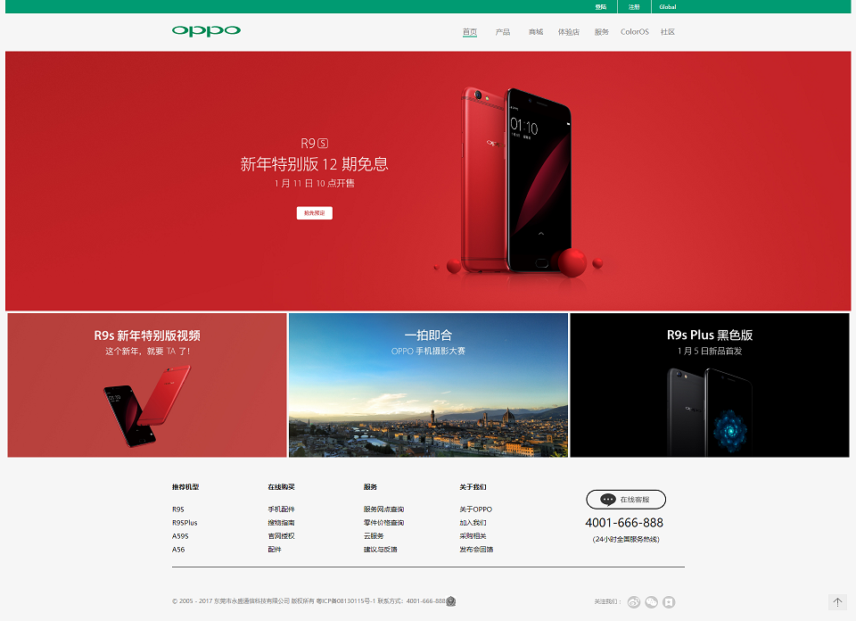

	

## H5

    

#### 一些HTML的练习

翻硬盘找到的，HTML基本使用，因为是2017年1月写的，选择模仿了当时Zealer和Oppo官网。

Demo:

[Zealer](https://ztygalaxy.github.io/H5/zealer/index.html)  [Oppo](https://ztygalaxy.github.io/H5/oppo/index.html)

效果：

	

	

#### 优秀H5赏析

[2016HTML5移动生态大会](https://ztygalaxy.github.io/H5/conference/index.html)